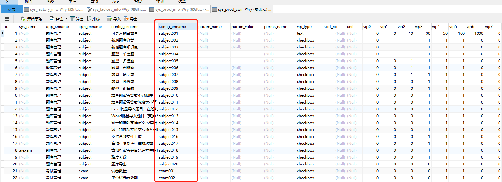

## 产品VIP功能限制说明文档

> 产品VIP功能限制相关注解分为4类:功能/请求/页面注解。
>
> 功能型验证：导入题目数量、学员账号、最大连接数等。
>
> 请求型验证：新增题库分类、新增知识点等。
>
> 对象属性验证：验证请求对象参数中的属性。
>
> 页面型验证：适用同一个url有多种类型的。例如：题型：单选题、多选题、简答题、填空题等。只配置一个注解

**相关说明：**

- ==<u>使用前需要配置产品项目地址:</u>==

```yaml
# 项目相关配置
gsh:
  #产品vip管理地址
  prodRestUrl: http://localhost:8090/aiexam
```

- ==<u>相关文件说明</u>==

`VipPermissionException.java` *vip功能限制异常类*

`VipPermissions.java` *vip功能限制注解类*

`VipPermissionAspect.java` *vip功能限制注解切面类*

`SysProductServiceImpl.java` *vip功能限制提供的服务类*

`sys_prod_conf `  *vip功能限制配置表*

`ProductUtils` vip功能限制工具类




### 功能验证

>  主要适用于对数量类型限制的验证，需要调用`ProductUtils`的`checkNumVipPermissions`方法

不用配置注解，需要调用`ProductUtils`里面的方法：

```java
	/**
	 * VIP权限验证数量，根据配置名称(根据产品配置表里面获取)、工厂id、相关数量 获取对应vip拥有的数值
	 * @param factoryCode
	 * @param cfName
	 * @param num
	 * @return AjaxResult
	 */
	public static Map<String, Object> checkNumVipPermissions(Long factoryCode, String cfName, int num){
		SysProductServiceImpl sysProductServiceImpl = SpringUtils.getBean("sysProductServiceImpl");
		return sysProductServiceImpl.checkNumVipPermissions(factoryCode, cfName, num);
	}
```

==示例代码：==

```java
//实际需要注入，这里为了方便这样写了
int currentNum = 1000;
AjaxResult rs = ProductUtils.checkNumVipPermissions(10000,"subject001",currentNum);
return rs;
```


### 请求验证（常用）

>  主要适用于简单的权限验证，支持一次验证多个条件。

需要在`VipPermissions`注解上指定`cfName`属性（数组类型）。

切面会根据配置的cfName做出限制，验证不通过直接抛异常返回。

==示例代码：==

```java

/**
* 修改保存产品配置
*/
@RequiresPermissions("system:prod:conf:edit")

//权限对应注解：cfName需要与配置表sys_prod_conf对应
@VipPermissions(cfName = {"demo"}, desc = "题型")

@PostMapping("/edit")
@ResponseBody
public AjaxResult editSave(SysProdConf sysProdConf){

```


### 对象属性验证

> 验证请求对象参数中的属性。

需要在`VipPermissions`注解上指定`moduleEnname`，`cfName`，`paramName`属性

==示例代码：==

```java
//这里会验证sysProdInfo参数里面中包含cfName配置的属性值
/**
*moduleEnname : sys_prod_conf的module_enname字段
*cfName : sys_prod_conf的config_enname字段
*paramName : 方法里面的参数对象名称
*/

@VipPermissions(moduleEnname = "demo",
        cfName = {"demo01","demo02"},
        desc = "题型",
        paramName = "sysProdInfo")
@RequiresPermissions("system:prod:info:edit")
@Log(title = "产品信息", businessType = BusinessType.UPDATE)
@PostMapping("/edit")
@ResponseBody
public AjaxResult editSave(SysProdInfo sysProdInfo){
    SysProductServiceImpl st = new SysProductServiceImpl();
    st.checkNumVipPermissions(Long.valueOf("10000"),"subject001",100);
    return toAjax(sysProdInfoService.updateSysProdInfo(sysProdInfo));
}
```


### 页面验证

> 主要适用于配置同一个方法对应不同类型的VIP限制判断。

比如单选题、多选题、简单题都是一个方法。注解需要把所有类型的配置都加上，切面会自动匹配配置和参数值，对应上的就会验证。

==示例代码：==

```java
   /**
     * 新增保存单选题
     */
    @RequiresPermissions("subject:subject:add")
    @Log(title = "保存题目", businessType = BusinessType.INSERT)

    /**
    权限对应注解：
    cfName对应sys_prod_conf表里配置的config_enname
    paramName对应url上的可变参数名称
    paramValue对应url上的枚举值
    
    注意：cfName和paramValue的数组顺序必须对应，比如subject004是单选题，1对应也是单选题
    
    */
    @VipPermissions(cfName = {"subject004","subject005"，"subject006}, desc = "题型",paramName = "type", paramValue={"1","2","3"})

    @PostMapping("/saveSubject/{type}")
    @ResponseBody
    public AjaxResult saveSubject(@PathVariable("type") String type, AiexamSubject aiexamSubject){
    	// 将图片格式进行转换
    	reBuildImageUrl(aiexamSubject, "0");

```